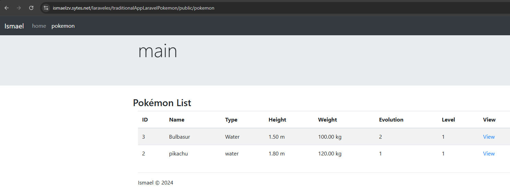

# traditionalLaravelApp

Aplicación Tradicional de Laravel.
Esta es una aplicación web desarrollada en Laravel que permite a los usuarios crear, ver y listar pokemon.


## Instalación

Sigue estos pasos para descargar y configurar el repositorio:

1. Clona el repositorio:

    ```sh
    git clone https://github.com/aluqmor/pokemonAppLaravel.git
    ```

2. Navega al directorio del proyecto:

    ```sh
    cd tu-repositorio
    ```

3. Instala las dependencias de Composer:

    ```sh
    composer install
    ```

4. Copia el archivo database.sql y crea la base de datos junto con usuario y contraseña.

5. Cambia el nombre de `.env.example` a `.env`.

6. Configura tu base de datos en el archivo `.env`:

    ```env
    DB_CONNECTION=mysql
    DB_HOST=127.0.0.1
    DB_PORT=3306
    DB_DATABASE=nombre_de_tu_base_de_datos
    DB_USERNAME=tu_usuario
    DB_PASSWORD=tu_contraseña
    ```

7. Genera la clave de la aplicación:

    ```sh
    php artisan key:generate
    ```

8. Ejecuta las migraciones para crear las tablas necesarias:

    ```sh
    php artisan migrate
    ```


#Capturas

Home


Home de pokemon con la lista



Loggin


Lista de pokemon con login realizado


Página de edición de un pokemon 


Página de view de un pokemon 


Página de delete de un pokemon 


Página de creación de un pokemon 


